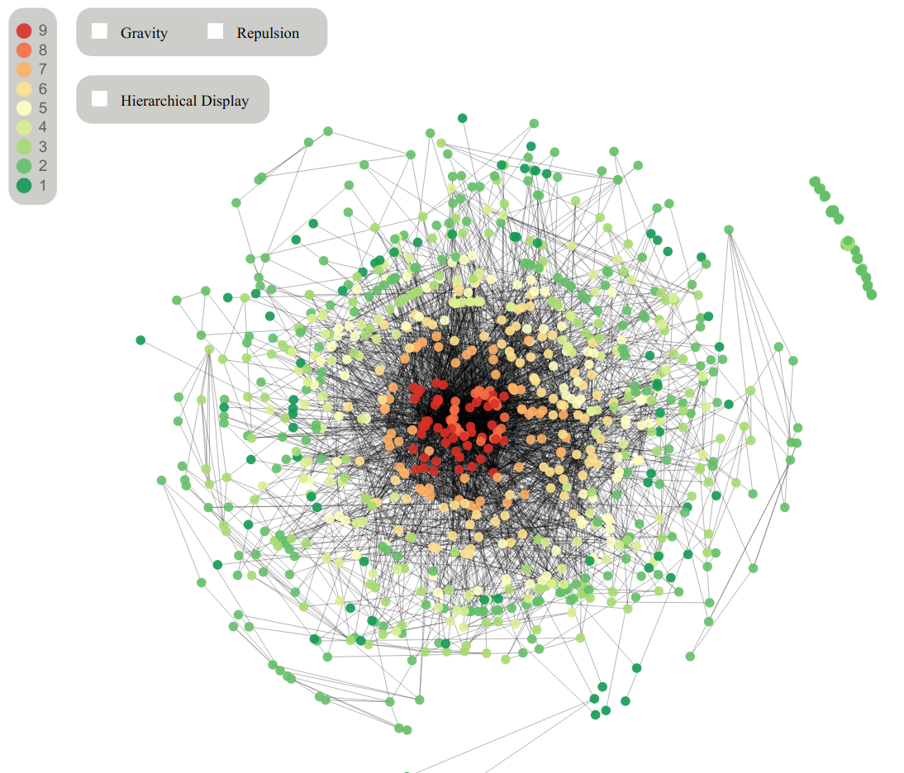

> 数据格式

**input.csv**和**ouput.csv**由[算法处理模块](https://github.com/Edward-Elric233/GraphLayout)得到

## 2020.10.15

### 成果

成功在本地运行绘制代码，新增了缩放、颜色等。

### 经验

发现用IDEA写网站容易出现一些奇怪的BUG，还是需要一个VScode比较好

### 计划

添加交互按钮

## 2020.10.21

### 成果

添加力导引布局，添加交互按钮，可以通过按钮控制分层、引力斥力、选择某一层的点、拖拽某一个点等操作

### 计划

添加PH直方图